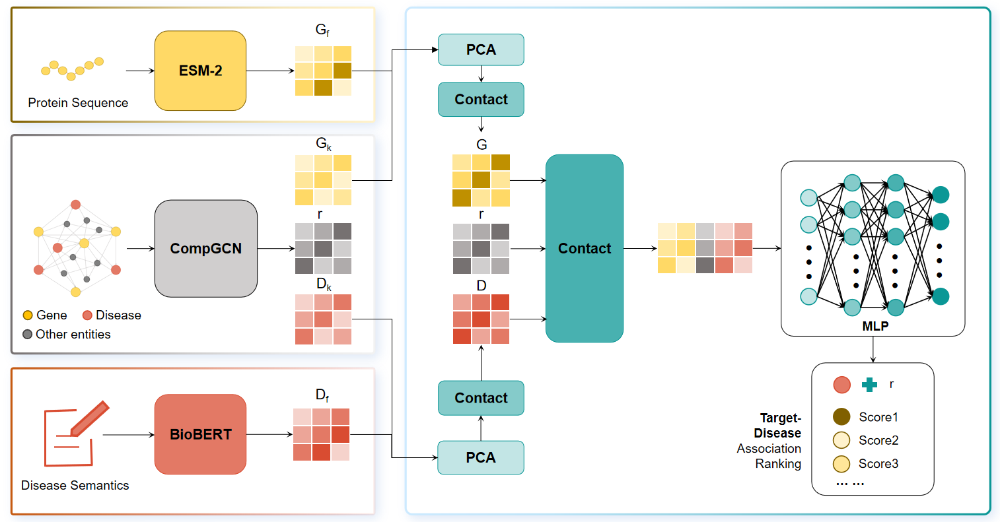

# **TarDIS**

TarDis generates protein sequence embeddings (Gf,)using ESM-2 (650Mparameters), graph structural embeddings (Gk, R and Dk) for disease nodetarget-disease relationship, and target node using CompGCN, and diseasesemantic embeddings (Df,) using BiBERT, Before training the MLP model.TarDis fuses these embeddings for diseases and targets into G and Drespectively, which are then fed into the MLP network to infer target-diseaseassociations.

## Python Dependencies

Dependencies for TarDis:

* Compatible with PyTorch 2.0 and Python 3.9+.
* Dependencies can be installed using pykeen.yml

## Dataset

* We use TarKG_core dataset for knowledge graph link prediction.

## How to run

### Data & Code Prepare

To run TarDis, plz clone the repo。

### **Training Stage**

The training process of the TarDis model is divided into two stages: knowledge graph embedding and multilayer perceptron.

In the knowledge graph embedding training stage, we use PyKEEN to train the CompGCN model. Users can follow the cmd in run_kge_hpo.sh.

In the multilayer perceptron training stage, users can follow the cmd in run_mlp_hpo.sh.

### **Inference Stage**

During the inference stage, Users can follow the cmd in mlp_predict.ipynb or mlp_predict.py.

## **Baseline**

To establish a baseline comparison for the performance of the TarDis model, this study employs knowledge graph embedding methods provided by PyKEEN as baseline models. You can run the following command on GPUs to train baseline models.

>
> #训练CompGCN 模型，使用GPU 0
>
> bash run_kge_baseline_rescal_conve.sh CompGCN 0
>
> #训练RESCAL 模型，使用 GPU 0
>
> bash run_kge_baseline_rescal_conve.sh RESCAL 0
>
> #训练ConvE模型，使用GPU 0
>
> bash run_kge_baseline_rescal_conve.sh ConvE 0
>
> #训练TransE模型，使用GPU 0
>
> bash run_kge_baseline_rescal_conve.sh TransE 0
>
> #训练TransR模型，使用GPU 0
>
> bash run_kge_baseline_rescal_conve.sh TransR 0
>
> #训练RotatE模型，使用GPU 0
>
> bash run_kge_baseline_rescal_conve.sh RotatE 0
>
> #训练DistMult模型，使用GPU 0
>
> bash run_kge_baseline_rescal_conve.sh DistMult 0
>
> #训练ComplEX模型，使用GPU 0
>
> bash run_kge_baseline_rescal_conve.sh ComplEX 0
